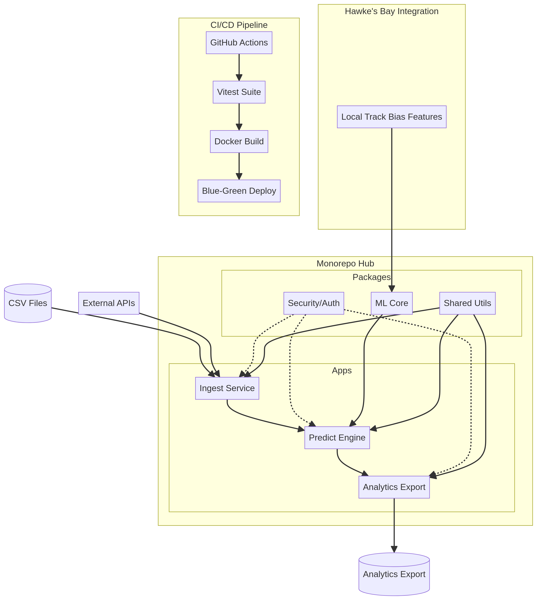

# Unified Backend Monorepo Hub

## Overview
This monorepo orchestrates the end-to-end flow for horse racing prediction and analytics, with a specific focus on **Hawke's Bay** local track bias.



## Core Pipeline
1. **Ingest**: Consumes data from CSV and external APIs.
2. **Predict**: Ensemble prediction engine incorporating local track bias features.
3. **Analytics**: Exporting insights and performance metrics.

## Security
- **OAuth 2.0**: For user authentication.
- **Manual Credentials**: Secure handling of API keys.
- **Audit**: Automated security scanning in CI/CD.

## Testing & CI/CD
- **Vitest**: High-coverage testing suite (>90% coverage).
- **GitHub Actions**: Automated build, test, and blue-green deployment.

## Getting Started
```bash
pnpm install
pnpm test
pnpm dev
```
